# Static-Website


1. Go to the AWS management console and signin
2. Make sure you are in the region where you want to create your s3 bucket for this region
3. Navigate to the S3 service in the AWS management console
4. Click on Create bucket

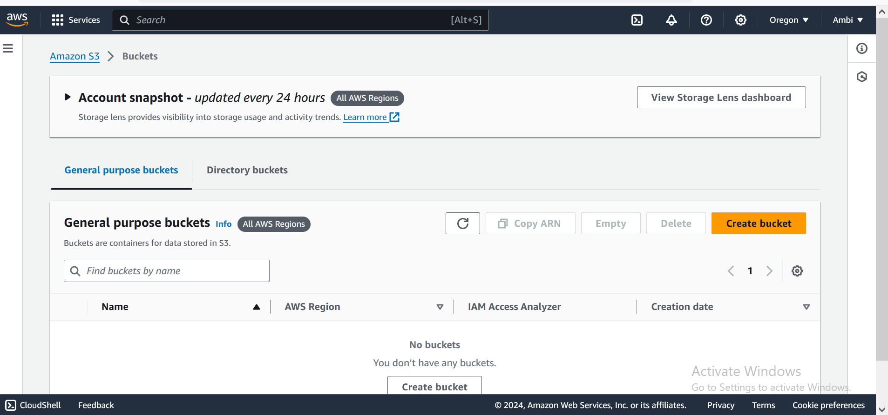


5. provide a unique name for your bucket and select the AWS Region where you want to create the bucket

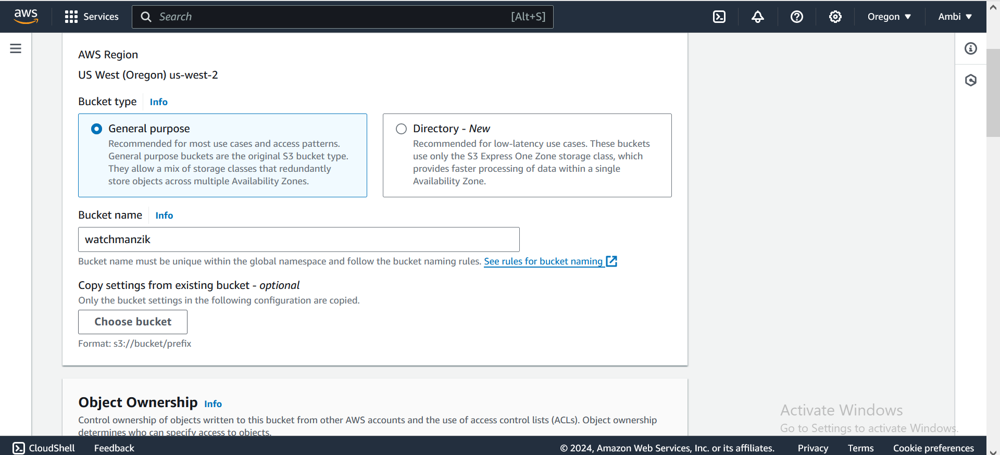


6. Select Acls (enabled)

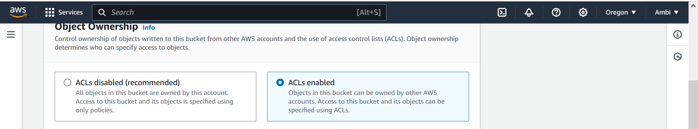


7. You will see the block all public access settings. By default, all options under this setting are checked to prevent pubblic access
   1. Uncheck the "Block all public access option". This action will automatically uncheck all related actions beneath it
   2. A warning message will appear emphasizing the risks associated with making your bucket publicly acessible. Below this message you will find an acknowledgement checkbox
   4. check the acknowlegement box to confirm that you understand the consequences of enabling public access to your bucket
  
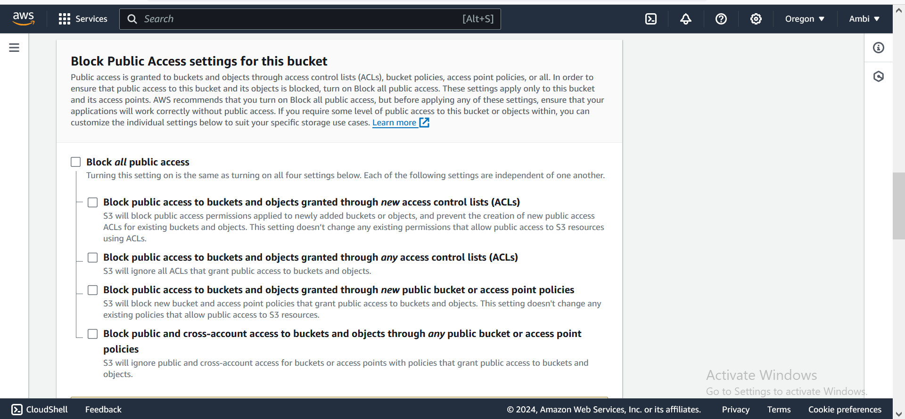

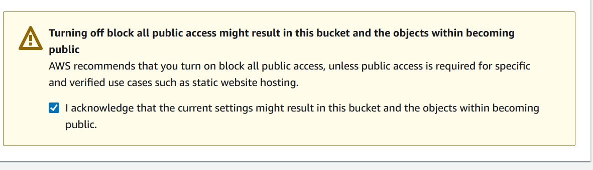

8. Click create bucket to finalize the bucket creation process

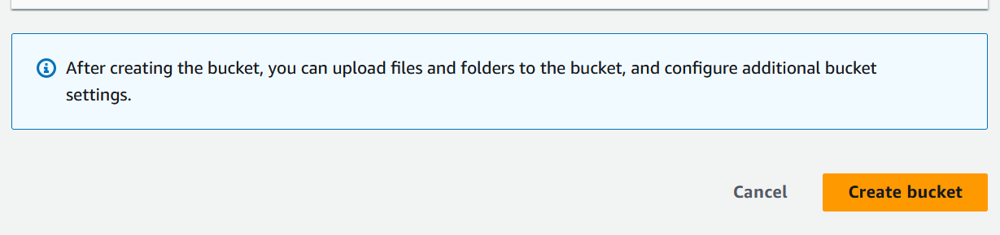

9. To allow public access, you will need to add a bucket policy explicitly granting such permissions
10. In the s3 dashboard, click on your newly created bucket's name

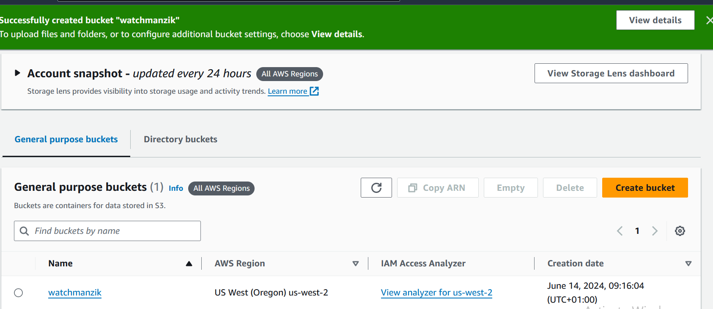

11. Go to the Permissions tab

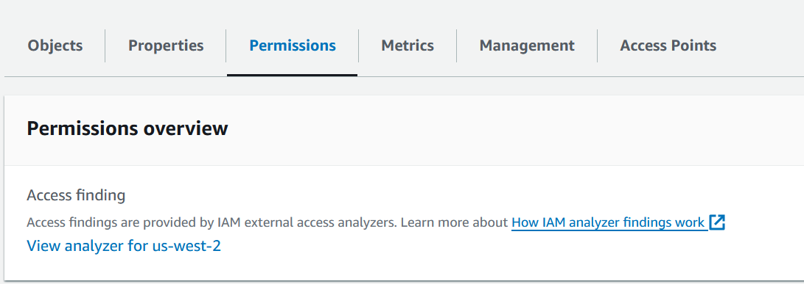

12. Scroll to the bucket policy section and click "Edit"

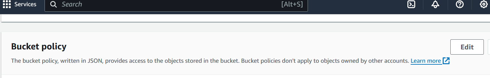

13. In the policy, copy and paste the following and replace YOUR_BUCKET_NAME with the name of your S3 bucket:

```
{
  "Version": "2012-10-17",
  "Statement": [
    {
      "Sid": "AddPerm",
      "Effect": "Allow",
      "Principal": "*",
      "Action": "s3:GetObject",
      "Resource": "arn:aws:s3:::YOUR_BUCKET_NAME/*"
    }
  ]
}
```

This policy will allow public access to all objects in your S3 objects

Add your bucket name instead of watchmanzik

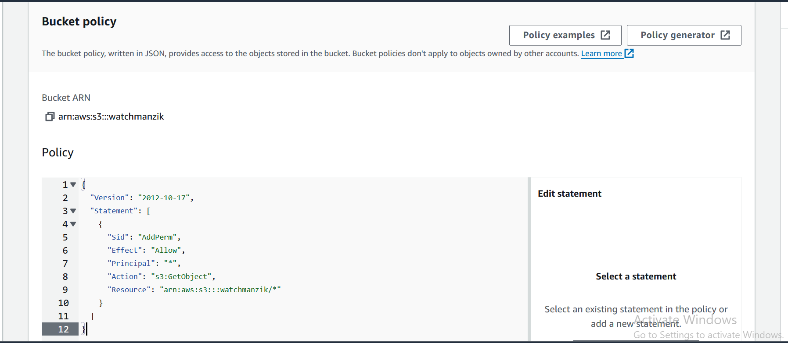

14. To save your bucket policy, at the bottom of the page, click save changes
    the bucket overview page will load and you will see a notification that the policy has been edited

    note: if you see an error, ensure that the bucket name has been correctly entered into the policy

15. Let us enable static website hosting, click on the properties tab

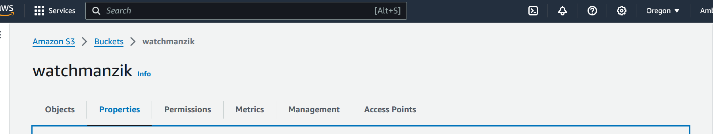

16. Scroll down to find the static website hosting option and click on edit

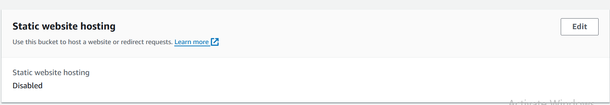

17. Select Enable to enable static website hosting &
    1. Choose Host a Static website. Here, you will be prompted to enter:
       1. Index document:the name of your homepage document(index.html). This is the file served when visitors access the root url of your website
       2. Error document(optional): The name of the HTML file to show when an error occurs(e.g error.html).This is not mandatory but recommended for handling HTTP errors
    2. (Optional) If you have a custom error document, fill in the error document field.
    3. Click save changes
   
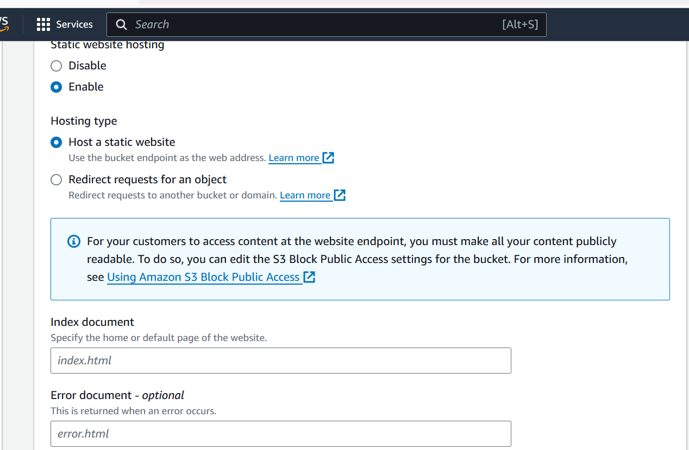

This is the Link to the contents that you need to upload

<a href="https://github.com/techiecoder2079/Nerflix-website">Nerflix Website Repository</a>

Go to the Objects tab & Click Upload to upload your static website files (HTML, CSS, JavaScript, images, etc.).

18. Click on Add files to add files to S3 Bucket

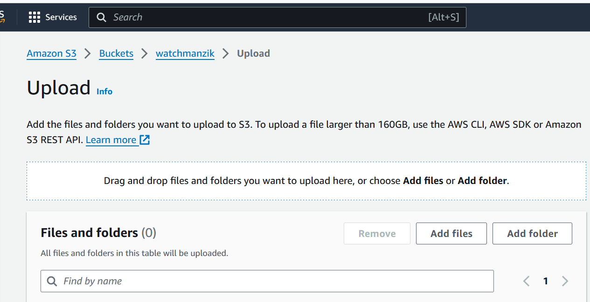


