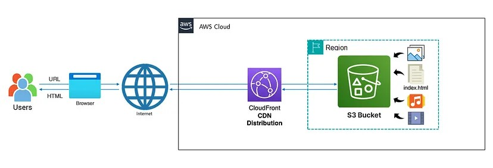

# Static-Website

1. Go to the AWS management console and signin
2. Make sure you are in the region where you want to create your s3 bucket for this region
3. Navigate to the S3 service in the AWS management console
4. Click on Create bucket

5. provide a unique name for your bucket and select the AWS Region where you want to create the bucket
6. Select Acls (enabled)
7. You will see the block all public access settings. By default, all options under this setting are checked to prevent pubblic access
   1. Uncheck the "Block all public access option". This action will automatically uncheck all related actions beneath it
   2. A warning message will appear emphasizing the risks associated with making your bucket publicly acessible. Below this message you will find an acknowledgement checkbox
   3. check the acknowlegement box to confirm that you understand the consequences of enabling public access to your bucket

